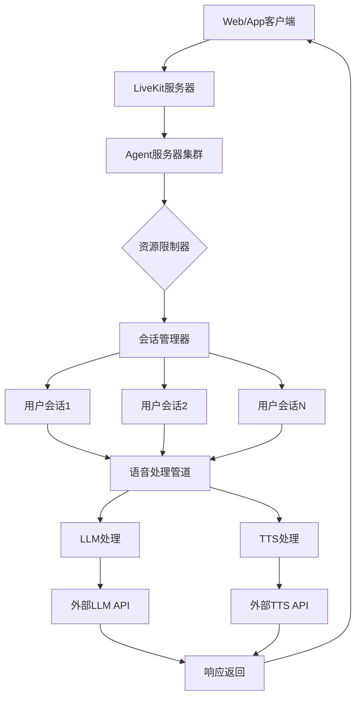
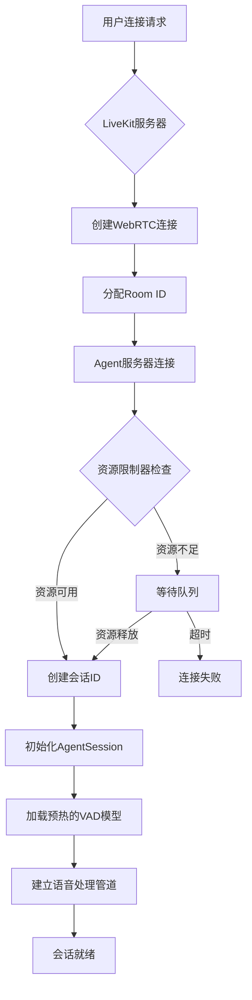
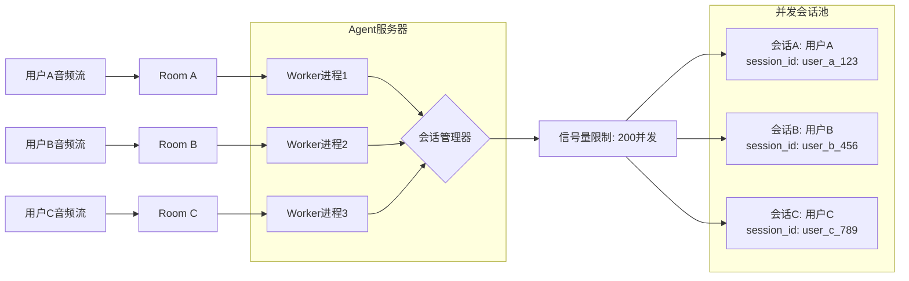
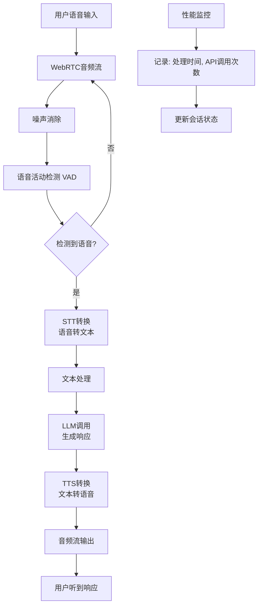
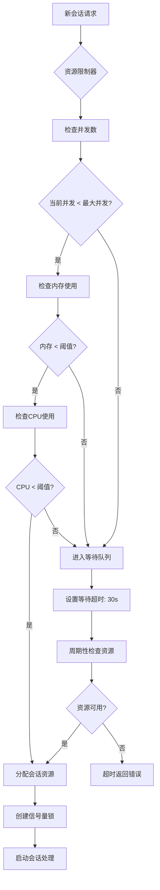
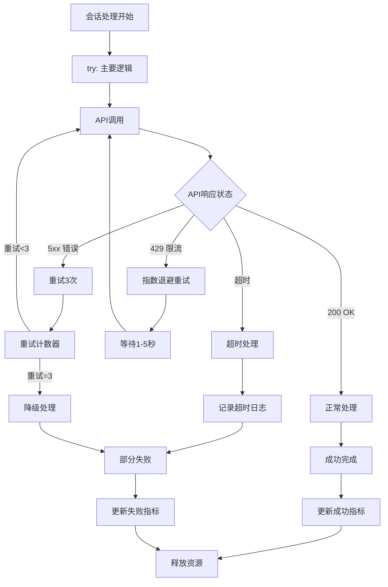
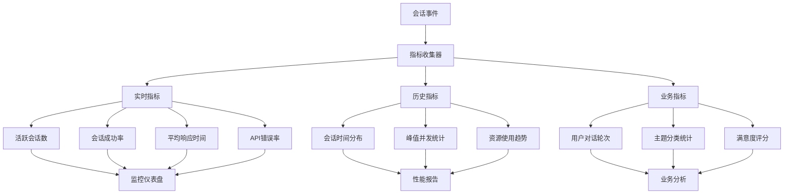

# 多用户Agent并发处理架构流程图

## 系统架构总览



## 详细处理流程

### 1. 用户连接阶段



### 2. 并发会话处理



### 3. 语音处理管道（每个会话）



### 4. 资源管理和限制



### 5. 错误处理和容错



### 6. 性能监控和指标收集



## 关键组件说明

### 1. **LiveKit服务器**
- 处理WebRTC连接
- 管理音频/视频流
- 房间和参与者管理
- SIP电话集成支持

### 2. **Agent服务器集群**
- **多个Worker进程**：每个进程独立处理会话
- **共享预热模型**：VAD等模型在进程间共享
- **负载均衡**：LiveKit自动分配连接到不同Worker

### 3. **资源限制器**
```python
class ResourceLimiter:
    def __init__(self, max_concurrent: int):
        self.max_concurrent = max_concurrent
        self.semaphore = asyncio.Semaphore(max_concurrent)
    
    async def acquire(self):
        """获取资源许可，控制并发"""
        async with self.semaphore:
            yield
```

### 4. **会话管理器**
- 为每个用户创建唯一的 `session_id`
- 维护会话状态和上下文
- 隔离用户数据，确保隐私
- 管理会话生命周期

### 5. **语音处理管道**
```
用户语音 → 噪声消除 → VAD检测 → STT转换 → 
文本处理 → LLM生成 → TTS合成 → 音频输出
```

### 6. **性能监控系统**
- **实时指标**：Prometheus格式
- **结构化日志**：JSON格式，便于分析
- **健康检查**：/health, /ready端点
- **告警机制**：阈值触发通知

## 并发处理示例

### 场景：3个用户同时对话

```python
# 用户A的会话
async def handle_user_a():
    session_id = "user_a_room_123"
    async with session_limiter.acquire(session_id):
        # 独立的语音管道
        session = AgentSession(
            llm=CustomLLM(),
            tts=SparkTTSPlugin(),
            vad=shared_vad_model  # 共享的预加载模型
        )
        await process_conversation(session)

# 用户B的会话（并行处理）
async def handle_user_b():
    session_id = "user_b_room_456"
    async with session_limiter.acquire(session_id):
        # 独立的语音管道
        session = AgentSession(
            llm=CustomLLM(),
            tts=SparkTTSPlugin(),
            vad=shared_vad_model  # 共享的预加载模型
        )
        await process_conversation(session)

# 两个会话并行执行
await asyncio.gather(
    handle_user_a(),
    handle_user_b()
)
```

## 性能指标基准

| 指标 | 目标值 | 说明 |
|------|--------|------|
| 最大并发用户 | 200 | 4核CPU，8GB内存 |
| 平均响应时间 | < 3秒 | 端到端延迟 |
| 会话成功率 | > 95% | 成功完成的会话比例 |
| API错误率 | < 5% | 外部API调用失败率 |
| 内存使用 | < 1GB | 每个Worker进程 |
| CPU使用 | < 80% | 避免过载 |

## 扩展策略

### 垂直扩展
- 增加CPU核心数 → 提高单个实例并发数
- 增加内存容量 → 支持更多会话上下文

### 水平扩展
```yaml
# Kubernetes部署配置
replicas: 3  # 3个实例
resources:
  limits:
    cpu: "1"      # 每个实例1核
    memory: "1Gi" # 每个实例1GB内存
```

### 总并发计算
```
总并发用户数 = 实例数 × 单实例并发数
             = 3 × 200 = 600用户
```

## 总结

多用户Agent并发处理的核心原则：

1. **隔离性**：每个用户会话完全独立
2. **资源共享**：预加载模型在会话间共享
3. **资源限制**：严格控制并发数，防止过载
4. **监控告警**：实时跟踪性能指标
5. **容错处理**：自动重试和降级机制
6. **可扩展性**：支持水平和垂直扩展

这种架构确保了：
- ✅ 用户间数据隔离和安全
- ✅ 高并发下的稳定性能
- ✅ 资源的高效利用
- ✅ 系统的可观测性
- ✅ 故障的快速恢复